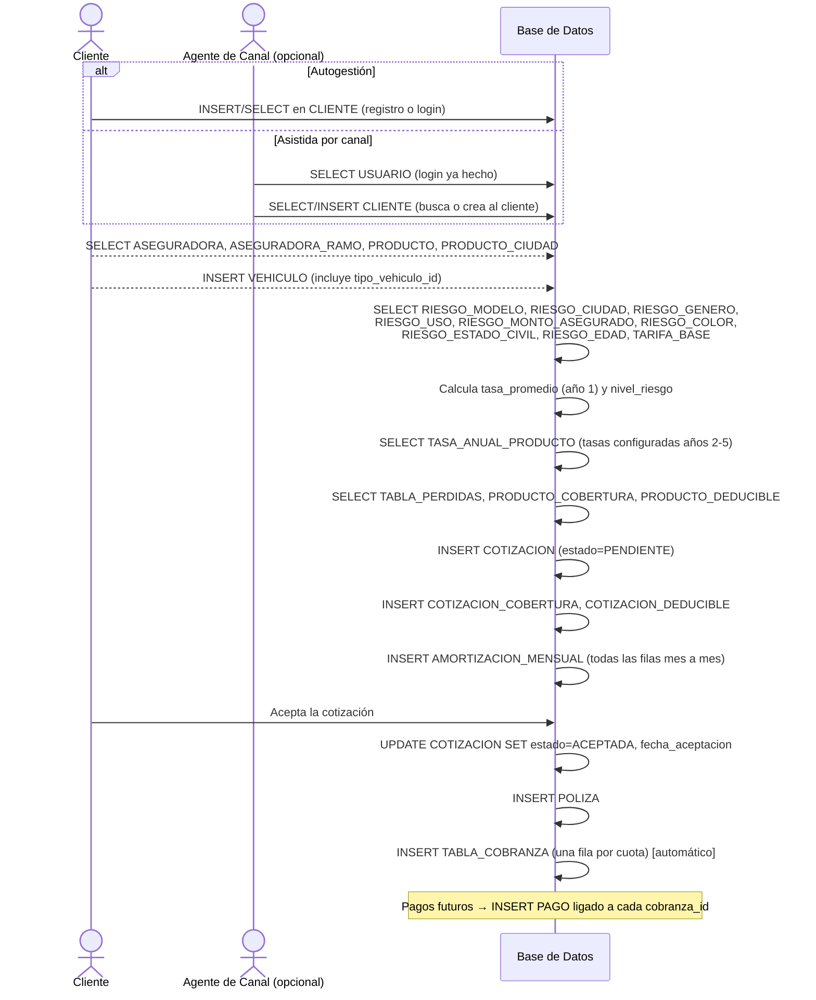

# Plataforma Multi-Aseguradora de Cotización ("Netflix de los Seguros")
## Modelo Entidad-Relación y especificación funcional

> Este documento es la fuente de verdad del negocio y del modelo de datos.
> Está pensado para pegarse en Claude Code (VS Code) y guiar el desarrollo
> **incremental** (NO se debe generar todo el proyecto de una sola vez — el
> desarrollo se irá indicando módulo por módulo).
>
> Complementa a `UNINOVA_NOW_spec_modelo_datos.md` (que trae el detalle línea
> por línea de las fórmulas del Excel original). Aquí esas mismas fórmulas se
> re-scopean para que cada aseguradora tenga su propia configuración.

---

## 1. Concepto del negocio

Plataforma tipo marketplace donde **varias aseguradoras (tenants)** configuran
sus propios productos de seguro vehicular. Cada aseguradora:

- Define sus **productos**, divididos en **canales** (ej. EMPRESAS / INDIVIDUAL,
  o canales adicionales que ella misma cree).
- Configura de forma **100% independiente**: coberturas, cláusulas, tasas de
  riesgo (por marca, ciudad, género, uso, monto, color, estado civil, edad),
  depreciación y tabla de pérdidas.
- Puede tener **productos distintos por ciudad**, o un producto único válido
  para todas las ciudades (bandera `aplica_todas_ciudades`).

**Dos tipos de actores se autentican en el sistema, de forma distinta:**

1. **Personal interno / aliados** (`USUARIO`): se provisiona en cascada —
   Sistemas (tú) crea el `ADMIN_ASEGURADORA` de cada aseguradora → ese admin
   crea las credenciales de sus `USUARIO_CANAL` (agentes/brokers).
2. **Clientes finales** (`CLIENTE`): se **autoregistran** en la plataforma
   (flujo inicial: tipo INDIVIDUAL) para poder solicitar cotizaciones
   directamente, sin depender de un canal. El cliente **no pertenece a una
   aseguradora** — es de la plataforma y puede cotizar con varias.

**Flujo end-to-end:**
```
Cliente se registra / Agente de canal lo atiende
        ↓
Cotización (usa el motor de tarificación del producto elegido)
        ↓
Cliente ACEPTA la cotización
        ↓
Se emite PÓLIZA (entidad propia, separada de la cotización)
        ↓
Se genera TABLA_COBRANZA (cronograma de fechas/cuotas)
        ↓
Se registran PAGOS contra cada cuota (sin pasarela de pago por ahora)
```

---

## 2. Diagrama Entidad-Relación completo

```mermaid
erDiagram
    ASEGURADORA ||--o{ CANAL : define
    ASEGURADORA ||--o{ PRODUCTO : configura
    ASEGURADORA ||--o{ USUARIO : emplea
    ASEGURADORA ||--o{ ASEGURADORA_SUSCRIPCION : contrata
    ASEGURADORA ||--o{ ASEGURADORA_RAMO : activa

    PLAN_SUSCRIPCION ||--o{ ASEGURADORA_SUSCRIPCION : origina
    PLAN_SUSCRIPCION ||--o{ PLAN_SUSCRIPCION_RAMO : incluye
    RAMO_BASE ||--o{ PLAN_SUSCRIPCION_RAMO : referencia
    RAMO_BASE ||--o{ ASEGURADORA_RAMO : referencia
    ASEGURADORA_RAMO ||--o{ PRODUCTO : clasifica

    CANAL ||--o{ PRODUCTO : agrupa
    CANAL ||--o{ USUARIO : agrupa_agentes

    PRODUCTO ||--o{ PRODUCTO_CIUDAD : "restringe a (si no aplica todas)"
    PRODUCTO ||--o{ PRODUCTO_COBERTURA : ofrece
    PRODUCTO ||--o{ PRODUCTO_CLAUSULA : incluye
    PRODUCTO ||--o{ PRODUCTO_DEDUCIBLE : aplica
    COBERTURA_BASE ||--o{ PRODUCTO_COBERTURA : origina
    CLAUSULA_BASE ||--o{ PRODUCTO_CLAUSULA : origina
    DEDUCIBLE_BASE ||--o{ PRODUCTO_DEDUCIBLE : origina
    PRODUCTO_COBERTURA ||--o{ PRODUCTO_DEDUCIBLE : "especifico de (opcional)"
    PRODUCTO ||--o{ TIPO_VEHICULO : clasifica
    PRODUCTO ||--o{ RIESGO_MODELO : parametriza
    PRODUCTO ||--o{ RIESGO_CIUDAD : parametriza
    PRODUCTO ||--o{ RIESGO_GENERO : parametriza
    PRODUCTO ||--o{ RIESGO_USO : parametriza
    PRODUCTO ||--o{ RIESGO_MONTO_ASEGURADO : parametriza
    PRODUCTO ||--o{ RIESGO_COLOR : parametriza
    PRODUCTO ||--o{ RIESGO_ESTADO_CIVIL : parametriza
    PRODUCTO ||--o{ RIESGO_EDAD : parametriza
    PRODUCTO ||--o{ TABLA_DEPRECIACION : parametriza
    PRODUCTO ||--o{ TABLA_PERDIDAS : parametriza
    PRODUCTO ||--o{ TARIFA_BASE : parametriza
    PRODUCTO ||--|| PARAMETRO_MODELO_MENSUAL : define
    PRODUCTO ||--o{ TASA_ANUAL_PRODUCTO : define
    PRODUCTO ||--o{ TASA_POR_NIVEL_RIESGO : define
    PRODUCTO ||--o{ COTIZACION : origina

    CIUDAD ||--o{ PRODUCTO_CIUDAD : referencia
    CIUDAD ||--o{ RIESGO_CIUDAD : referencia
    CIUDAD ||--o{ CLIENTE : reside_en
    CIUDAD ||--o{ COTIZACION : ubicacion_riesgo

    PERFIL ||--o{ USUARIO : clasifica

    CLIENTE ||--o{ VEHICULO : posee
    CLIENTE ||--o{ COTIZACION : solicita
    TIPO_VEHICULO ||--o{ VEHICULO : clasifica

    USUARIO ||--o{ COTIZACION : "asiste (opcional)"

    COTIZACION ||--o{ COTIZACION_COBERTURA : incluye
    COTIZACION ||--o{ COTIZACION_DEDUCIBLE : incluye
    COTIZACION ||--o{ AMORTIZACION_MENSUAL : calcula
    COTIZACION ||--o| POLIZA : "se convierte en (si es aceptada)"

    POLIZA ||--o{ TABLA_COBRANZA : genera
    TABLA_COBRANZA ||--o{ PAGO : recibe

    AUDITORIA }o--|| USUARIO : registrada_por

    ASEGURADORA {
        uuid id PK
        string nombre_comercial
        string razon_social
        string ruc
        string logo_url
        boolean activo
        timestamp creado_en
    }

    CANAL {
        uuid id PK
        uuid aseguradora_id FK
        string nombre "EMPRESAS | INDIVIDUAL | personalizado"
        string descripcion
        boolean activo
    }

    PRODUCTO {
        uuid id PK
        uuid aseguradora_id FK
        uuid canal_id FK
        uuid aseguradora_ramo_id FK
        string nombre
        boolean aplica_todas_ciudades
        boolean activo
        timestamp creado_en
    }

    RAMO_BASE {
        uuid id PK
        string nombre "VEHICULO | VIDA | ASISTENCIA_MEDICA | HOGAR..."
        text descripcion
        boolean activo
    }

    PLAN_SUSCRIPCION {
        uuid id PK
        string nombre "BASICO | PROFESIONAL | ENTERPRISE"
        text descripcion
        int max_ramos "null = ilimitado"
        decimal precio_mensual
        boolean activo
    }

    PLAN_SUSCRIPCION_RAMO {
        uuid plan_suscripcion_id FK
        uuid ramo_base_id FK
    }

    ASEGURADORA_SUSCRIPCION {
        uuid id PK
        uuid aseguradora_id FK
        uuid plan_suscripcion_id FK
        date fecha_inicio
        date fecha_fin "null = vigente"
        string estado "ACTIVA|VENCIDA|CANCELADA"
    }

    ASEGURADORA_RAMO {
        uuid id PK
        uuid aseguradora_id FK
        uuid ramo_base_id FK
        boolean activo
        date fecha_activacion
    }

    PRODUCTO_CIUDAD {
        uuid producto_id FK
        uuid ciudad_id FK
    }

    CIUDAD {
        uuid id PK
        string nombre
        string provincia
    }

    COBERTURA_BASE {
        uuid id PK
        string nombre
        text descripcion_generica
        boolean activo
    }

    CLAUSULA_BASE {
        uuid id PK
        string titulo
        text texto_generico
        boolean activo
    }

    DEDUCIBLE_BASE {
        uuid id PK
        string nombre
        string tipo_calculo "PORCENTAJE | VALOR_FIJO"
        text descripcion
        boolean activo
    }

    PRODUCTO_COBERTURA {
        uuid id PK
        uuid producto_id FK
        uuid cobertura_base_id FK
        decimal valor_o_porcentaje
        int orden
        boolean activo
    }

    PRODUCTO_CLAUSULA {
        uuid id PK
        uuid producto_id FK
        uuid clausula_base_id FK
        text texto_personalizado "null = usa el texto_generico del catalogo"
        int orden
        boolean activo
    }

    PRODUCTO_DEDUCIBLE {
        uuid id PK
        uuid producto_id FK
        uuid deducible_base_id FK
        uuid producto_cobertura_id FK "nullable: null = deducible general del producto"
        decimal valor
        boolean activo
    }

    TIPO_VEHICULO {
        uuid id PK
        uuid producto_id FK
        string descripcion "LIVIANOS PARTICULARES | ALTA GAMA | ALQUILER..."
    }

    RIESGO_MODELO {
        uuid id PK
        uuid producto_id FK
        string marca
        string modelo
        int nivel_riesgo "1 Alto 2 Moderado 3 Bajo"
        text justificacion
    }

    RIESGO_CIUDAD {
        uuid id PK
        uuid producto_id FK
        uuid ciudad_id FK
        int nivel_riesgo
        text justificacion
    }

    RIESGO_GENERO {
        uuid id PK
        uuid producto_id FK
        string genero "HOMBRE | MUJER"
        decimal porcentaje_participacion
        int nivel_riesgo
    }

    RIESGO_USO {
        uuid id PK
        uuid producto_id FK
        string uso "COMERCIAL | PARTICULAR | CORPORATIVO"
        int nivel_riesgo
    }

    RIESGO_MONTO_ASEGURADO {
        uuid id PK
        uuid producto_id FK
        decimal monto_desde
        decimal monto_hasta
        int nivel_riesgo
    }

    TASA_POR_NIVEL_RIESGO {
        uuid id PK
        uuid producto_id FK
        int nivel_riesgo "1 Alto 2 Moderado 3 Bajo"
        decimal tasa
    }

    RIESGO_COLOR {
        uuid id PK
        uuid producto_id FK
        string color
        int nivel_riesgo
    }

    RIESGO_ESTADO_CIVIL {
        uuid id PK
        uuid producto_id FK
        string estado_civil
        int nivel_riesgo
    }

    RIESGO_EDAD {
        uuid id PK
        uuid producto_id FK
        int edad_desde
        int edad_hasta
        int nivel_riesgo
    }

    TABLA_DEPRECIACION {
        uuid id PK
        uuid producto_id FK
        string tipo "NUEVO_1ER_ANIO|NUEVO_DESDE_2DO|USADO_1ER_ANIO|USADO_DESDE_2DO"
        decimal porcentaje
    }

    TABLA_PERDIDAS {
        uuid id PK
        uuid producto_id FK
        int nivel_riesgo
        string perdidas_parciales
        string perdidas_totales
    }

    TARIFA_BASE {
        uuid id PK
        uuid producto_id FK
        uuid tipo_vehiculo_id FK
        string tiempo_credito "HASTA 2 AÑOS | 3 A 5 AÑOS"
        int riesgo_marca
        int riesgo_ciudad
        int riesgo_genero
        int riesgo_uso
        decimal depreciacion
        decimal tasa
    }

    PARAMETRO_MODELO_MENSUAL {
        uuid id PK
        uuid producto_id FK
        decimal super_bancos_pct
        decimal seguro_campesino_pct
        decimal derechos_emision_valor
        decimal iva_pct
    }

    TASA_ANUAL_PRODUCTO {
        uuid id PK
        uuid producto_id FK
        int numero_anio "2, 3, 4, 5 (el año 1 usa la tasa_promedio de la cotización)"
        decimal tasa
    }

    PERFIL {
        uuid id PK
        string codigo "ADMIN_PLATAFORMA|ADMIN_ASEGURADORA|USUARIO_CANAL"
        string descripcion
    }

    USUARIO {
        uuid id PK
        uuid perfil_id FK
        uuid aseguradora_id FK "null solo para ADMIN_PLATAFORMA"
        uuid canal_id FK "null salvo USUARIO_CANAL"
        string nombre
        string email
        string password_hash
        boolean activo
        timestamp creado_en
    }

    CLIENTE {
        uuid id PK
        string tipo_cliente "INDIVIDUAL | EMPRESA"
        string nombre_razon_social
        string identificacion "cedula | ruc"
        string email
        string password_hash
        string telefono
        uuid ciudad_id FK
        string direccion
        date fecha_nacimiento "solo individual"
        string genero "solo individual"
        string estado_civil "solo individual"
        string representante_legal "solo empresa"
        boolean activo
        timestamp fecha_registro
    }

    VEHICULO {
        uuid id PK
        uuid cliente_id FK
        uuid tipo_vehiculo_id FK
        string marca
        string modelo
        int anio
        string color
        decimal valor_asegurado
        string estado_vh "NUEVO | USADO"
        string uso
        string placa
    }

    COTIZACION {
        uuid id PK
        uuid aseguradora_id FK
        uuid producto_id FK
        uuid cliente_id FK
        uuid vehiculo_id FK
        uuid usuario_id FK "null si fue autogestión del cliente"
        uuid ciudad_id FK
        string origen "AUTOGESTION | CANAL"
        int anios_vigencia
        decimal tasa_promedio
        int nivel_riesgo
        decimal cuota_fija_mensual
        string estado "PENDIENTE|ACEPTADA|RECHAZADA|EXPIRADA"
        timestamp creado_en
        timestamp fecha_aceptacion
    }

    COTIZACION_COBERTURA {
        uuid id PK
        uuid cotizacion_id FK
        uuid producto_cobertura_id FK
        decimal valor_aplicado
    }

    COTIZACION_DEDUCIBLE {
        uuid id PK
        uuid cotizacion_id FK
        uuid producto_deducible_id FK
        uuid cotizacion_cobertura_id FK "nullable: null = deducible general"
        decimal valor_aplicado
    }

    AMORTIZACION_MENSUAL {
        uuid id PK
        uuid cotizacion_id FK
        int mes
        decimal valor_asegurado_mes
        decimal prima_neta_mes
        decimal super_bancos
        decimal seguro_campesino
        decimal derechos_emision
        decimal subtotal
        decimal iva
        decimal prima_total_mes
        decimal cuota_fija
        decimal diferencia
        decimal nivelacion_acumulada
    }

    POLIZA {
        uuid id PK
        uuid cotizacion_id FK
        string numero_poliza
        date fecha_emision
        date fecha_inicio_vigencia
        date fecha_fin_vigencia
        string estado "VIGENTE|VENCIDA|CANCELADA"
    }

    TABLA_COBRANZA {
        uuid id PK
        uuid poliza_id FK
        int numero_cuota
        date fecha_vencimiento
        decimal monto
        string estado "PENDIENTE|PAGADO|VENCIDO"
    }

    PAGO {
        uuid id PK
        uuid cobranza_id FK
        date fecha_pago
        decimal monto_pagado
        string metodo_pago
        string referencia
        uuid usuario_registro_id FK
        string estado "REGISTRADO|ANULADO"
    }

    AUDITORIA {
        uuid id PK
        string entidad "COTIZACION|POLIZA|TARIFA_BASE|..."
        uuid entidad_id
        string accion "CREACION|EDICION|CAMBIO_ESTADO"
        jsonb datos_anteriores
        jsonb datos_nuevos
        uuid usuario_id FK
        timestamp creado_en
    }
```



---

## 3. Flujo operativo de cotización (qué tabla se lee/escribe en cada paso)

Este es el recorrido que debe seguir el sistema desde que el cliente entra a
cotizar hasta que queda con su cronograma de cobranza listo. Es la referencia
que debe usar Claude Code para implementar el motor de cotización — el orden
importa y no debe alterarse.

1. **Registro / login del cliente** — Si es la primera vez, se crea un
   registro en `CLIENTE` (`tipo_cliente=INDIVIDUAL`, `email`,
   `password_hash`). Si ya existe, solo se valida el login contra esa misma
   tabla. Este paso no depende de ninguna aseguradora.

2. **Explorar aseguradoras, ramos y productos disponibles** — Se consulta
   `ASEGURADORA` (activas) → `ASEGURADORA_RAMO` (ramos que esa aseguradora
   activó, ej. VEHICULO) → `PRODUCTO` (productos de ese ramo/canal). Si el
   producto tiene `aplica_todas_ciudades = false`, se filtra además por
   `PRODUCTO_CIUDAD` contra la ciudad del cliente.

3. **Registrar el vehículo a asegurar** — Se crea un registro en `VEHICULO`
   (marca, modelo, año, color, valor asegurado, uso, estado nuevo/usado, y
   `tipo_vehiculo_id` — la categoría configurada por el producto, ej.
   particular/alta gama/alquiler), ligado a `cliente_id`. Si el cliente ya
   tiene vehículos registrados, puede reutilizar uno existente.

4. **El motor consulta las tablas de riesgo y tarifa del producto elegido** —
   Con el `producto_id` ya definido, se leen en paralelo `RIESGO_MODELO`,
   `RIESGO_CIUDAD`, `RIESGO_GENERO`, `RIESGO_USO`, `RIESGO_MONTO_ASEGURADO`,
   `RIESGO_COLOR`, `RIESGO_ESTADO_CIVIL`, `RIESGO_EDAD` (con la edad
   calculada al vuelo desde `CLIENTE.fecha_nacimiento`) y `TARIFA_BASE`
   (esta última usando además `VEHICULO.tipo_vehiculo_id`) — todas filtradas
   por ese `producto_id`, cruzando los datos del cliente y del vehículo.

5. **Se calcula la tasa promedio y el nivel de riesgo** — Cada uno de los 8
   factores anteriores (excepto `TARIFA_BASE`) solo devuelve un
   `nivel_riesgo` (1/2/3); ese nivel se traduce a tasa consultando
   `TASA_POR_NIVEL_RIESGO` del producto. Con esas 8 tasas + la tasa propia de
   `TARIFA_BASE` se obtiene `tasa_promedio` (AVERAGE de las 9). El
   `nivel_riesgo` general de la cotización es el de `RIESGO_MODELO` del
   vehículo. Con ese `nivel_riesgo` se consulta `TABLA_PERDIDAS` para la
   cobertura de pérdidas parciales/totales, y se listan las opciones de
   `PRODUCTO_COBERTURA` y `PRODUCTO_DEDUCIBLE` disponibles en ese producto
   para que el cliente elija.

6. **Se guarda la cotización completa** — Se inserta la fila principal en
   `COTIZACION` (`estado = PENDIENTE`) con la tasa y cuota calculadas. Junto
   con eso se insertan las "fotos" de lo elegido en `COTIZACION_COBERTURA` y
   `COTIZACION_DEDUCIBLE`, y las 12–60 filas del detalle mes a mes en
   `AMORTIZACION_MENSUAL` (usando `PARAMETRO_MODELO_MENSUAL` del producto).
   **Recomendación**: los pasos 4, 5 y 6 deben ejecutarse en una sola
   transacción de base de datos, para que nunca quede una `COTIZACION` sin su
   `AMORTIZACION_MENSUAL` completa.

7. **El cliente acepta o rechaza la cotización** — Si rechaza, solo se
   actualiza `COTIZACION.estado = RECHAZADA` y termina el flujo. Si acepta,
   se actualiza `COTIZACION.estado = ACEPTADA` + `fecha_aceptacion`, y se
   dispara la creación de un registro en `POLIZA` (`numero_poliza`,
   `fecha_inicio_vigencia`, `fecha_fin_vigencia`).

8. **Se genera el cronograma de cobranza** — A partir de la `POLIZA` recién
   creada se generan automáticamente las filas de `TABLA_COBRANZA` (una por
   cada cuota, con su `fecha_vencimiento` y `monto = cuota_fija_mensual`).
   Esto **debe ser automático** (trigger o lógica de backend disparada por el
   cambio de estado de la póliza), nunca una acción manual del cliente. De
   ahí en adelante, cada pago que se registre manualmente crea una fila en
   `PAGO` ligada a su `cobranza_id` correspondiente.

### Variante: cotización asistida por un agente de canal

Si quien cotiza es un `USUARIO_CANAL` (no el cliente directo), el paso 1
cambia: el agente ya está autenticado como `USUARIO`, y en el paso 2 él
busca o crea el `CLIENTE` (con o sin login propio). En ese caso,
`COTIZACION.usuario_id` queda con el id del agente y
`COTIZACION.origen = CANAL`. Si fue el propio cliente quien cotizó solo,
`usuario_id` queda `NULL` y `origen = AUTOGESTION`.



---

## 4. Reglas clave de diseño (para que Claude Code no las reinterprete)

1. **Aislamiento total por `producto_id`**: todas las tablas de riesgo/tarifas
   (`RIESGO_*`, `TABLA_DEPRECIACION`, `TABLA_PERDIDAS`, `TARIFA_BASE`,
   `PARAMETRO_MODELO_MENSUAL`) cuelgan de `producto_id`, nunca directamente de
   `aseguradora_id` — así una aseguradora puede tener productos distintos
   (ej. uno para Quito/Guayaquil y otro para el resto del país) sin cruzarse.
2. **`RIESGO_CIUDAD` es por producto**: si `producto.aplica_todas_ciudades =
   true`, se espera una fila de `RIESGO_CIUDAD` por cada ciudad relevante
   igual; si es `false`, las ciudades permitidas están en `PRODUCTO_CIUDAD` y
   sólo esas deberían tener fila en `RIESGO_CIUDAD`.
3. **`CLIENTE` es de la plataforma, no de una aseguradora**: nunca debe llevar
   `aseguradora_id`. La relación con la aseguradora vive en `COTIZACION` (y
   luego en `POLIZA` a través de la cotización).
4. **Cascada de credenciales**: `ADMIN_PLATAFORMA` crea `ADMIN_ASEGURADORA` →
   `ADMIN_ASEGURADORA` crea `USUARIO_CANAL` de su propia aseguradora/canal →
   `CLIENTE` se autoregistra sin intervención de nadie (tipo INDIVIDUAL en la
   primera fase).
5. **`COTIZACION.usuario_id` nullable** distingue autogestión (cliente solo)
   de asistida (agente de canal) vía el campo `origen`.
6. **`POLIZA` sólo existe si `COTIZACION.estado = ACEPTADA`** (relación 1:1
   opcional). Al crearse la póliza se dispara la generación de
   `TABLA_COBRANZA` (una fila por cuota, según `anios_vigencia * 12` o el
   plan de pagos que se defina).
7. **Auditoría genérica**: la tabla `AUDITORIA` es agnóstica a la entidad
   (patrón `entidad` + `entidad_id` + JSON antes/después) para no crear una
   tabla de historial por cada entidad. Se registra al menos en: `COTIZACION`
   (creación y cambios de estado), `POLIZA` (creación, cambios de estado),
   `TARIFA_BASE` y demás tablas `RIESGO_*` (ediciones), `PAGO` (registro y
   anulación).
8. **Patrón "catálogo base + personalización por producto"**: igual que
   `CIUDAD` (catálogo global) se combina con `RIESGO_CIUDAD` (la aseguradora
   define el riesgo/tasa de esa ciudad para SU producto), lo mismo aplica a:
   - `COBERTURA_BASE` → `PRODUCTO_COBERTURA` (la aseguradora elige coberturas
     del catálogo general y define su valor/porcentaje para su producto)
   - `CLAUSULA_BASE` → `PRODUCTO_CLAUSULA` (elige cláusulas del catálogo y
     opcionalmente sobreescribe el texto genérico)
   - `DEDUCIBLE_BASE` → `PRODUCTO_DEDUCIBLE` (elige un deducible; si
     `producto_cobertura_id` es `NULL` es un deducible general del producto/
     póliza, si tiene valor es el deducible específico de esa cobertura)
   Esto evita que cada aseguradora escriba desde cero coberturas/cláusulas/
   deducibles que en la práctica son estándar del mercado, sin dejar de
   permitirle personalizar valores y textos. Cuando se genera una cotización,
   `COTIZACION_COBERTURA` y `COTIZACION_DEDUCIBLE` toman una "foto" (snapshot)
   de los valores vigentes en `PRODUCTO_COBERTURA` / `PRODUCTO_DEDUCIBLE` en
   ese momento, para que cambios posteriores en la configuración del producto
   no alteren cotizaciones ya emitidas.
9. **Ramo dentro de un plan de suscripción**: `RAMO_BASE` es un catálogo
   general de la plataforma (VEHICULO, VIDA, ASISTENCIA_MEDICA, HOGAR...).
   Cada `ASEGURADORA` contrata un `PLAN_SUSCRIPCION` (registrado en
   `ASEGURADORA_SUSCRIPCION`, con histórico de vigencia), y ese plan define
   qué ramos tiene disponibles (`PLAN_SUSCRIPCION_RAMO`). Dentro de lo que su
   plan permite, la aseguradora **activa** los ramos que efectivamente va a
   operar (`ASEGURADORA_RAMO` — esta es la tabla que representa "el plan que
   arma la aseguradora"). Cada `PRODUCTO` se crea sobre un `ASEGURADORA_RAMO`
   ya activado, nunca directamente sobre `RAMO_BASE`, para garantizar que
   nadie cree un producto de un ramo que la aseguradora no tiene contratado.
10. **Tasa por año de vigencia configurable, no calculada**: solo el año 1 de
    la póliza usa la tasa que arroja el motor de riesgo (`tasa_promedio` de
    la cotización). Del año 2 en adelante, la tasa **la define la aseguradora
    por producto** en `TASA_ANUAL_PRODUCTO` — así se confirmó revisando el
    Excel original, donde esos valores estaban tipeados a mano y no salían de
    ninguna fórmula de riesgo. No se debe recalcular el riesgo para los años
    2-5; solo se consulta esta tabla.
11. **Tipo de vehículo sí afecta la tasa (diseño completado respecto al
    Excel)**: en el Excel original, la hoja `TARIFICACIÓN` definía tasas
    distintas según el tipo de vehículo (particulares / alta gama desde
    $40.000 / alquiler), pero esa tabla nunca se conectó a ninguna fórmula
    activa — la pantalla `COTIZACIÓN` nunca pedía el tipo de vehículo, y el
    cálculo real usaba una tabla simplificada sin esa dimensión. En la
    plataforma se **completa el diseño**: `VEHICULO.tipo_vehiculo_id` se
    captura al registrar el vehículo, y `TARIFA_BASE` sí se usa con las 4
    dimensiones de riesgo + tipo de vehículo + tiempo de crédito, tal como
    sugería la estructura original de `TARIFICACIÓN`.
12. **Edad siempre calculada, nunca almacenada como número fijo**: aunque en
    el Excel se tipeaba la edad manualmente, `CLIENTE` solo guarda
    `fecha_nacimiento`; la edad usada en `RIESGO_EDAD` se calcula en el
    momento de cada cotización, para que nunca quede desactualizada.
13. **8 de los 9 factores de riesgo comparten una sola escala de tasas**:
    auditando las fórmulas `P12:P19` del Excel se confirmó que `RIESGO_MODELO`,
    `RIESGO_CIUDAD`, `RIESGO_GENERO`, `RIESGO_USO`, `RIESGO_COLOR`,
    `RIESGO_ESTADO_CIVIL`, `RIESGO_EDAD` y `RIESGO_MONTO_ASEGURADO` **no**
    tienen cada uno su propia tasa — todos clasifican en `nivel_riesgo`
    (1/2/3) y ese nivel se traduce a tasa mediante la tabla compartida
    `TASA_POR_NIVEL_RIESGO` (por producto). Solo `TARIFA_BASE` (el 9º factor,
    que combina tiempo de crédito + tipo de vehículo) tiene una tasa
    verdaderamente propia e independiente de esa escala.

---

## 5. Motor de cálculo (resumen — detalle completo en `UNINOVA_NOW_spec_modelo_datos.md`)

La lógica es la misma del Excel original, pero **todas las búsquedas ahora
filtran primero por `producto_id`** antes de aplicar la fórmula.

**Hallazgo clave de la auditoría**: los 8 primeros componentes del promedio
(`P12:P19` en el Excel — modelo, uso, ciudad, género, color, estado civil,
edad, monto asegurado) **no tienen cada uno su propia tasa** — las 8 fórmulas
devuelven un valor de la misma celda `PARAMETRIZACIÓN!B9:B11`. Es decir, son
8 formas distintas de clasificar al cliente/vehículo en **Alto/Moderado/Bajo**,
y las 3 categorías comparten **una sola escala de tasas** (`0.042 / 0.036 /
0.029` en el caso de prueba). Solo el 9º componente (`P20`, tiempo de crédito
+ tipo de vehículo) tiene una tasa verdaderamente independiente, tomada de
`TARIFICACIÓN!I3:I14` (valores como 0.049, 0.044, etc., distintos a la escala
de los otros 8).

Por eso `RIESGO_MODELO`, `RIESGO_CIUDAD`, `RIESGO_GENERO`, `RIESGO_USO` y
`RIESGO_MONTO_ASEGURADO` **no guardan una tasa propia** — igual que
`RIESGO_COLOR`, `RIESGO_ESTADO_CIVIL` y `RIESGO_EDAD`, solo clasifican en
`nivel_riesgo` (1/2/3). La tasa real de esos 8 componentes sale de la nueva
tabla **`TASA_POR_NIVEL_RIESGO`** (por producto: nivel → tasa), que es la
que cada aseguradora configura para su escala Alta/Moderada/Baja:

```
tasa_promedio(cotizacion) = AVERAGE(
    tasa_por_nivel(nivel_riesgo de RIESGO_MODELO          WHERE producto_id = X),
    tasa_por_nivel(nivel_riesgo de RIESGO_USO             WHERE producto_id = X),
    tasa_por_nivel(nivel_riesgo de RIESGO_CIUDAD          WHERE producto_id = X),
    tasa_por_nivel(nivel_riesgo de RIESGO_GENERO          WHERE producto_id = X),
    tasa_por_nivel(nivel_riesgo de RIESGO_COLOR           WHERE producto_id = X),
    tasa_por_nivel(nivel_riesgo de RIESGO_ESTADO_CIVIL    WHERE producto_id = X),
    tasa_por_nivel(nivel_riesgo de RIESGO_EDAD            WHERE producto_id = X,
                    edad = calculada a partir de CLIENTE.fecha_nacimiento
                    en la fecha de la cotización, nunca un valor fijo guardado),
    tasa_por_nivel(nivel_riesgo de RIESGO_MONTO_ASEGURADO WHERE producto_id = X),
    tasa_por_tarifa_base   (TARIFA_BASE WHERE producto_id = X,        -- ÚNICO componente
                             tipo_vehiculo_id = VEHICULO.tipo_vehiculo_id,   -- con tasa
                             tiempo_credito = derivado de anios_vigencia,     -- INDEPENDIENTE
                             riesgo_marca = nivel_riesgo de RIESGO_MODELO,
                             riesgo_ciudad = nivel_riesgo de RIESGO_CIUDAD,
                             riesgo_genero = nivel_riesgo de RIESGO_GENERO,
                             riesgo_uso = nivel_riesgo de RIESGO_USO)
)
-- donde tasa_por_nivel(n) = lookup(TASA_POR_NIVEL_RIESGO WHERE producto_id = X, nivel_riesgo = n)

nivel_riesgo(cotizacion) = nivel_riesgo de RIESGO_MODELO del vehículo cotizado
cobertura_perdidas = lookup(TABLA_PERDIDAS WHERE producto_id = X, nivel_riesgo)
```

**Nota**: `TARIFA_BASE.depreciacion` (heredada de la columna "DEPRECIACIÓN" de
`TARIFICACIÓN`) es un valor distinto al de `TABLA_DEPRECIACION` (que sí está
conectada y es la que efectivamente se usa en el modelo de amortización
mensual). Se conserva en `TARIFA_BASE` como referencia/reporte de esa
combinación de tipo de vehículo + riesgos, pero **no reemplaza** a
`TABLA_DEPRECIACION` en el cálculo mes a mes.

El **modelo de amortización mensual** (valor asegurado que se deprecia mes a
mes, prima neta, impuestos, cuota fija por promedio y nivelación acumulada)
se mantiene exactamente igual a la sección 4.3 de `UNINOVA_NOW_spec_modelo_datos.md`,
usando `PARAMETRO_MODELO_MENSUAL` (por producto) en vez de constantes fijas.

**Tasa aplicable por año de vigencia** (evidencia tomada directamente del
Excel, hoja `MODELO MENSUALIZADO`, celdas `H6:H10`):

```
tasa_anual(y=1) = tasa_promedio de la cotización   -- celda H6: =COTIZACIÓN!I11 (fórmula)
tasa_anual(y>1) = lookup(TASA_ANUAL_PRODUCTO WHERE producto_id = X, numero_anio = y)
                                                     -- celdas H7:H10: valores fijos (0.0352),
                                                     -- tipeados a mano en el Excel original.
                                                     -- En la plataforma esto se vuelve
                                                     -- configurable por la aseguradora
                                                     -- en TASA_ANUAL_PRODUCTO, en vez de
                                                     -- que cada agente lo escriba a mano
                                                     -- por cotización.
```

Si `TASA_ANUAL_PRODUCTO` no tiene una fila para un `numero_anio` específico
(ej. la aseguradora solo configuró hasta el año 3 pero la póliza es a 5 años),
el sistema debe repetir la tasa del último año configurado — nunca dejar el
cálculo sin tasa.

---

## 6. Roles y permisos (resumen para el backend)

| Perfil | Puede |
|---|---|
| `ADMIN_PLATAFORMA` | Crear/editar aseguradoras, crear `ADMIN_ASEGURADORA`, ver todo el sistema |
| `ADMIN_ASEGURADORA` | Configurar productos, canales, coberturas, cláusulas, tarifas/riesgos de **su** aseguradora; crear `USUARIO_CANAL` propios; ver cotizaciones/pólizas/cobranzas de su aseguradora |
| `USUARIO_CANAL` | Cotizar y gestionar clientes dentro de su canal/aseguradora asignada |
| `CLIENTE` | Registrarse, cotizar (autogestión), ver sus propias cotizaciones/pólizas/cobranzas, aceptar/rechazar cotizaciones |

---

## 7. Sugerencia de orden de construcción (referencial — tú decides el ritmo real con Claude Code)

No se pide construir todo de una vez. Como referencia, el orden natural sería:

1. Esquema de base de datos completo en Supabase (todas las tablas de este documento) + seed de `CIUDAD` y `PERFIL`.
2. Módulo de autenticación por tabla propia (login `USUARIO` y login `CLIENTE`, JWT, cascada de creación de credenciales).
3. CRUD de configuración de producto para `ADMIN_ASEGURADORA` (canales, productos, coberturas, cláusulas, tablas de riesgo/tarifas).
4. Motor de cotización (cálculo de tasa, riesgo, cuota mensual y tabla de amortización) — reutilizando el caso de prueba del Excel para validar.
5. Flujo de aceptación de cotización → emisión de póliza → generación de tabla de cobranza.
6. Registro manual de pagos contra cobranza.
7. (Futuro) Integración de pasarela de pago real.

---

## 8. Caso de prueba de referencia

Usar el mismo caso de prueba documentado en `UNINOVA_NOW_spec_modelo_datos.md`
(sección 7), pero creando primero: una `ASEGURADORA` de prueba, un `PRODUCTO`
"Vehicular Individual" en canal `INDIVIDUAL`, con `aplica_todas_ciudades =
true`, y cargando las tablas `RIESGO_*` / `TARIFA_BASE` con los mismos valores
del Excel (ya extraídos en los CSV de `csv_export/`). El resultado del motor
de cálculo debe coincidir con:
- `tasa_promedio ≈ 0.035556`
- `nivel_riesgo → ALTO`
- `cuota_fija_mensual ≈ 101.768`
